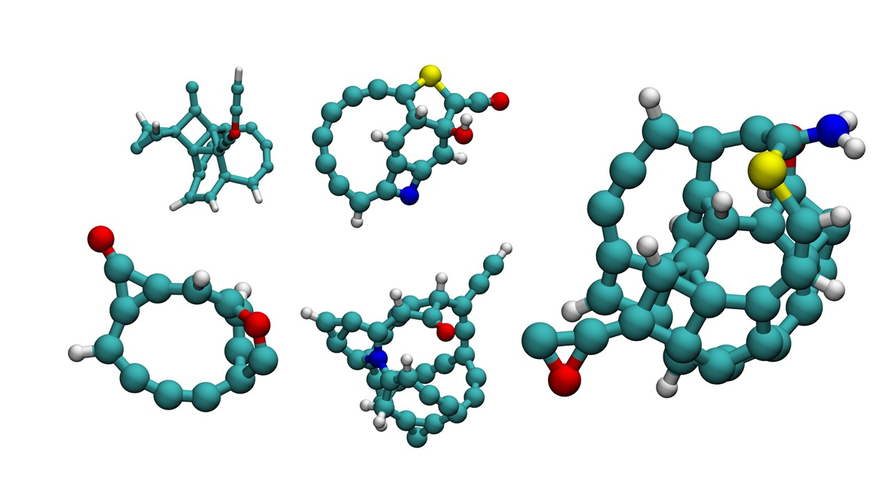

# Mindless Molecule Generator (Soot Edition)


`mindlessgen-soot` is based on [Minelessgen](https://github.com/grimme-lab/MindlessGen) as described [here](https://pubs.acs.org/doi/full/10.1021/ct800511q). Specifically for generating soot-like molecules. Soot molecules are particles with a high C:H ratio and few oxygen atoms. However, soot molecules are generally classified as polycyclic aromatic hydrocarbons (PAHs). This project cannot specifically generate PAHs; it can only produce carbonous particles.

This branch will not sync with [Minelessgen](https://github.com/grimme-lab/MindlessGen). 
## Examples



## Installation

Installation is the same with [Minelessgen](https://github.com/grimme-lab/MindlessGen). 

> [!IMPORTANT]
> `xtb` (see [here](https://github.com/grimme-lab/xtb)) has to be installed on your system, either via `conda-forge`, as a release binary, or compiled from source.
If post-processing with DFT is desired, also `orca` (see [here](https://www.faccts.de/docs/orca/6.0/manual/index.html)) has to be available.

It can be installed from the latest source code via cloning the repository:

```bash
git clone https://github.com/grimme-lab/MindlessGen.git # or the analogous SSH link
pip install .
```

## Usage

> [!WARNING]
> `mindlessgen` may still be subject to API changes.

`mindlessgen` can be executed after installation in the desired environment via:
```
mindlessgen -h
```
This command displays all command line options in the terminal.
In addition, all commands are accessible via the [TOML](https://github.com/grimme-lab/MindlessGen/blob/main/mindlessgen.toml) configuration file.
The template configuration file in the root directory of the repository contains comprehensive explanations for each of the available configuration keys.
If the path is not specified with `-c/--config`, `mindlessgen.toml` will be searched in the following locations, in order:
1. Current working directory (`$CWD`)
2. Home directory (`$USER/`)

The active configuration can be printed using `--print-config`.

### Element composition
There are two related aspects of the element composition:
1. _Which elements_ should occur within the generated molecule?
2. **How many atoms** of the specified element should occur?
- **Example 1**: `C:1-3, O:1-1, H:1-*` would result in a molecule with 1, 2, or 3 carbon atoms, exactly 1 oxygen atom, and between 1 and an undefined number of hydrogen atoms (i.e., at least 1).
- **Example 2**: `Na:10-10, In:10-10, O:20-20`. This example would result in a molecule with exactly 10 sodium atoms, 10 indium atoms, and 20 oxygen atoms. **For a fixed element composition, the number of atoms (40) has to be within the min_num_atoms and max_num_atom interval.** `mindlessgen` will consequently always return a molecule with exactly 40 atoms.

> [!WARNING]
> When using `orca` and specifying elements with `Z > 86`, ensure that the basis set you've selected is compatible with (super-)heavy elements like actinides.
> You can find a list of available basis sets [here](https://www.faccts.de/docs/orca/6.0/manual/contents/detailed/basisset.html#built-in-basis-sets).
> A reliable standard choice that covers the entire periodic table is `def2-mTZVPP`.

## Citation

When using the program for academic purposes, please cite:

_J. Chem. Theory Comput._ 2009, **5**, 4, 993–1003

or in `BibTeX` format:
```
@article{doi:10.1021/ct800511q,
author = {Korth, Martin and Grimme, Stefan},
title = {“Mindless” DFT Benchmarking},
journal = {Journal of Chemical Theory and Computation},
volume = {5},
number = {4},
pages = {993-1003},
year = {2009},
doi = {10.1021/ct800511q},
note ={PMID: 26609608},
URL = {https://doi.org/10.1021/ct800511q},
eprint = {https://doi.org/10.1021/ct800511q}
}
```

## Acknowdledgements

[T. Gasevic](https://github.com/gasevic) for creating an initial `GitHub` [migration](https://github.com/gasevic/mlmgen) of the code and making important adjustments to the workflow.
[S. Grimme](https://www.chemie.uni-bonn.de/grimme/de/grimme) and M. Korth for the original code written in Fortran associated to the publication in [J. Chem. Theory Comput.](https://pubs.acs.org/doi/full/10.1021/ct800511q).
